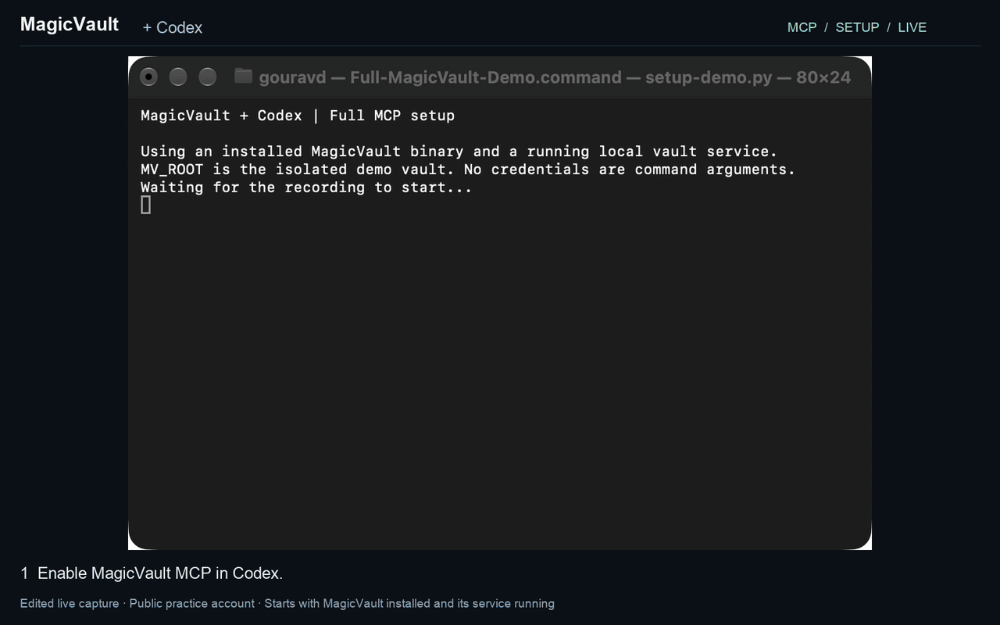

<div align="center">
  <h1>MagicVault</h1>
  <p><strong>Let agents use credentials without seeing them</strong></p>
  <p>
    <a href="CHANGELOG.md"></a>
    <a href="#quick-start"></a>
    <a href="#license"></a>
  </p>
  <p>
    <a href="#quick-start">Quick start</a> ·
    <a href="#what-works-today">Coverage</a> ·
    <a href="docs/architecture.md">Architecture</a> ·
    <a href="SECURITY.md">Security</a>
  </p>
</div>

Your agent needs to log in, call an API, or run a command—not receive your password.
MagicVault delivers credentials to an approved browser field, HTTP request or new
process. Use saved references for repeat tasks, or enter one-time browser credentials
in a native prompt when needed. The agent gets a status receipt without the values.



*Full 1:47 demo: enable MCP, enroll credentials, approve a real Codex login,
then inspect the transcript for credential values. Actual screens, edited for readability.
[Watch the MP4](docs/assets/magicvault-mcp-full-demo.mp4) · [Recording and audit details](docs/demo.md).*

This protects MagicVault's own tool calls and replies. Authorized recipients see
the credential, and separate browser tools can still read it afterward.

> [!WARNING]
> **Source alpha.** No public release or npm registry installation yet; local
> candidate packages only. Basic installed-browser/keychain/native-consent and
> selected remembered-use, permission/recovery and cancellation cases passed on
> one macOS/Chrome setup. Broader recovery, startup/process-delivery reliability
> and signed-release qualification remain open.
> Start with synthetic credentials. [Evidence and limits](docs/testing.md).

## How it works

1. **The agent requests a use.** For a one-time browser login it calls
   `secure_prompt_fill` with field names and selectors. Saved credentials use
   `secure_fill`, `secure_new_http` or `secure_new_process` with references.
2. **You enter and approve through native prompts.** One-time input ends with
   **Use once** and is never saved. Saved credentials support per-use approval
   or a human-created exact-use **Always allow** grant.
3. **MagicVault checks and delivers.** The agent receives only a receipt. Your
   browser tool still owns navigation and submission.

<a id="choose-your-interface"></a>

Use **MCP** with Codex, Claude Code or another local agent. Prefer the
[CLI](#cli-for-agents-and-scripts) for shell scripts, or the
[builder interfaces](#build-on-magicvault) for applications and extensions.

## Quick start

Requires **macOS Apple Silicon**, a logged-in desktop session and **Node.js 22+**
for npm launchers. No Rust toolchain is needed to use prebuilt candidates.
This is local stdio MCP—not a hosted endpoint or unattended credential access.

### 1. Install and set up a local candidate

Obtain two matching, trusted tarballs from a maintainer or the
[candidate build instructions](docs/distribution.md#build-local-candidates).
These are local filenames, **not published npm package names**.

```bash
export MAGICVAULT_NPM_DIR="$HOME/.local/share/magicvault-npm"
npm install --prefix "$MAGICVAULT_NPM_DIR" --ignore-scripts \
  ./magicvault-local-magicvault-darwin-arm64-0.9.0.tgz \
  ./magicvault-local-magicvault-0.9.0.tgz
export PATH="$MAGICVAULT_NPM_DIR/node_modules/.bin:$PATH"
magicvault --profile agent setup
magicvault --profile agent doctor
```

Explicit `setup`, not npm, installs the app/service/native host and initializes
custody/pairing. No credential enrollment is needed for one-time browser fills.
Keep the daemon running.
[Installation, upgrades and removal](docs/distribution.md).

<a id="use-with-an-mcp-agent"></a>

### 2. Connect your agent

Choose your client. These commands use the default paths and paired profile
`agent`; custom installations should use the configuration printed by `setup`.
MCP does not start the daemon or bypass native consent.

[Consent modes and revocation](docs/consent.md): per-use is the default; only the
human can create an exact-use Always allow grant. Website access is separate.

```bash
# Codex
codex mcp add magicvault -- "$HOME/.magicvault-app/current/bin/magicvault-mcp" \
  --profile agent
codex mcp list
```

```bash
# Claude Code (user-wide configuration)
claude mcp add --transport stdio --scope user magicvault -- \
  "$HOME/.magicvault-app/current/bin/magicvault-mcp" --profile agent
claude mcp get magicvault
```

Start a new agent session and ask for `vault_status` and `list_credentials`.
[Other clients and configuration](docs/setup.md#mcp).
Client references: [Codex](https://developers.openai.com/codex/mcp),
[Claude Code](https://code.claude.com/docs/en/mcp).

### 3. Authorize a destination and use it

For a browser without CDP, use **Developer mode → Load unpacked** in
`chrome://extensions` and select setup's `extension_directory`. Choose website
access and approve the matching browser profile ID. Connection is automatic.
[Full extension instructions](docs/browser-usage.md#chromium-extension).

For an automation browser, [register its loopback CDP websocket](docs/browser-usage.md#direct-cdp)
instead; no extension is needed. After opening the login page, ask your agent:

> Use MagicVault to discover the correct browser tab and request username and
> password with `secure_prompt_fill`. I will enter them in the native prompts
> and approve Use once. Poll the result before submitting the form.

Enter synthetic credentials only in the native windows, never in chat. Nothing is
saved. [One-time input, examples and limits](docs/jit-credentials.md).

For **saved credentials**, enroll once and authorize the exact trusted origin:

```bash
magicvault --profile agent enroll --label 'Demo account' --field password
magicvault --profile agent list-credentials
# Replace both placeholders with your reference and trusted test-page origin.
magicvault --profile agent configure-browser-credential \
  --credential-ref cred_REPLACE_WITH_ENROLLED_UUID \
  --field password --origin https://accounts.example.com
```

After opening that page with your browser tool, ask your agent:

> Use MagicVault to find my Demo account and the correct browser tab. Fill its
> password field with `secure_fill`, then poll the operation's status. Never
> retrieve or type the password through another tool.

For HTTP or commands, register a [fixed destination profile](docs/delivery-usage.md#register-once-approve-each-invocation)
instead, then ask the agent to use `secure_new_http` or `secure_new_process`.
Every delivery requires your approval. `filled`/`completed` does not prove login
or application success. Never automatically repeat a missing or uncertain operation.

## What works today

| Destination | Tool / conditions |
| --- | --- |
| One-time browser login without saved credentials | `secure_prompt_fill`; native hidden inputs and Use once, connected CDP/extension browser, no enrollment. Automated coverage; native UI acceptance pending. |
| Existing headed or modern headless Chrome/Chromium via CDP | `secure_fill`; accessible **loopback browser websocket**, current document and exact origin/field permission. No proxy or extension. |
| Existing Chrome/Chromium without CDP | `secure_fill`; unpacked extension **plus native host**, site grants and daemon policy. Native allow/deny tested on one macOS/Chrome setup; broader acceptance pending. |
| New HTTP(S) requests | `secure_new_http`; fixed URL/method and header, query or text/form/flat-JSON placements. Public HTTPS; HTTP only to explicit loopback IPs. |
| New command-line processes | `secure_new_process`; fixed executable/arguments/cwd, credentials through environment or stdin. No interactive terminal. |
| Already-running processes and stateful-service refresh | **Not implemented.** Requires a cooperating service/provider adapter. |
| Native app fields, Firefox and Safari | **Not implemented.** No accessibility or non-Chromium adapter. |

HTTP supports `GET`, `HEAD`, `POST`, `PUT`, `PATCH`, `DELETE`, `OPTIONS`, `TRACE`
and supported custom methods; no `CONNECT`, redirects or automatic retries.
Process output and HTTP response content are withheld. Headless browsers still
need the daemon's human-approval desktop. [Full coverage, frame conditions and limits](docs/coverage.md).

## CLI for agents and scripts

MCP is optional. The CLI exposes `secure-prompt-fill`, `secure-fill`, `secure-new-process` and
`secure-new-http` under `magicvault`, with the same paired daemon and native consent.
[CLI recipes](docs/cli-usage.md) cover discovery, reference-only request files,
status polling and cancellation. Scripts cannot approve themselves.

## Build on MagicVault

Use the **[Node/TypeScript SDK](docs/typescript.md)** from the npm package for
value-free requests in your own application. It includes CommonJS/ESM
exports and TypeScript declarations, uses the native CLI and requires the same
human setup and consent. Local candidates only; no public npm release yet.

Embed the **Rust custody/effect crates**, use the **authenticated local protocol**,
or implement the **native bridge in your existing Chromium extension** for deeper
integration. Material-bearing Rust/extension APIs must preserve authorization.
[Builder guide](docs/integrations.md).

### Rust toolchain

Source builds use Rust **edition 2021**; standalone MCP requires compiler **1.88+**.
[Build and foreground-service instructions](docs/setup.md#rust-toolchain)
include SSD1 artifact routing. Shared custody remains independent of the
standalone CLI/MCP; [embedded-consumer compatibility](docs/integrations.md#existing-embedded-consumers).

## Security: the promise and its boundary

MagicVault keeps entered credential values out of its supported agent-facing requests,
replies, errors and audit projections. It does **not** hide credentials from the
approved recipient, independent browser observations or unrestricted same-user
software. Password masking is not an observation filter.
[Threat model and private reporting](SECURITY.md).

## Documentation and contributing

[Documentation index](docs/README.md) ·
[Architecture and drift baseline](docs/architecture.md) ·
[Usage and coverage](docs/coverage.md) · [Qualification and runbooks](docs/qualification/README.md) ·
[Changelog](CHANGELOG.md) · [Versions](docs/versioning.md)

For issues, include the interface, version and OS/browser with a synthetic
reproduction. Never upload vaults, pairing files, live credentials or raw traces.

## License

[MIT](LICENSE-MIT) OR [Apache-2.0](LICENSE-APACHE).
