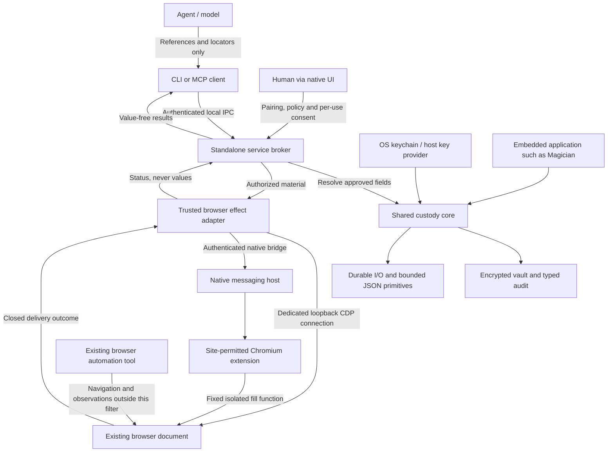

# MagicVault architecture

Architecture version: `0.3.0`

Baseline tag: `architecture/v0.3.0` — an immutable architecture reference, not
a package-release announcement.

This is the technical baseline for the standalone browser-delivery system and
its shared libraries. The version labels the architecture, not a production
certification or a registry publication. [Capabilities](../README.md#what-works-today)
and [security](../SECURITY.md) define the product's supported boundary.

## Components and trust boundaries

The client, broker, custody library and delivery adapter are different authority
boundaries. CLI/MCP requests contain references, not credential values. Trusted
core/effect/native code necessarily handles plaintext. The destination website
receives it; separate browser tools and unrestricted same-user software are not
isolated by this integration. Neither CDP nor the extension is a generic proxy.

| Component | Version | Ownership |
| --- | --- | --- |
| `magicvault`, `magicvault-mcp` | `0.3.0` | Human administration and reference-only agent clients; CLI package also builds the daemon/native host |
| `magicvault-service`, `magicvault-protocol` | `0.3.0` | One standalone store writer; caller authentication, policy, consent, jobs and bounded IPC |
| `magicvault-effect`, Chromium extension | `0.3.0` | Dedicated CDP or native document-targeted fill; no navigation or submission API |
| `magicvault-core` | `0.1.3` | Encryption, credential references, existing policies, scoped stores and typed audit |
| `magicvault-primitives` | `0.1.1` | Durable filesystem and stack-safe JSON utilities |

The local agent wire is version **2**; the native bridge wire is version **1**.
Wire versions and crate versions are distinct. See the [protocol](protocol.md)
for framing, message types and bounds, and [versioning](versioning.md) for upgrades.

## One fill, end to end

1. A human pairs a client and enrolls values through native hidden inputs. Listing
   metadata does not grant delivery. The human separately authorizes selected
   fields and exact origins for that client.
2. CDP registration or an approved extension connection creates a caller-owned
   browser handle. Discovery binds short-lived targets to the tab/frame, actual
   document and top/selected origins; another tool's snapshot IDs are not handles.
3. `secure_fill` admits a closed reference-only request, spends its target handle
   and operation ID, and requests consent for that exact destination and fields.
4. Immediately before delivery, the service rechecks authority, cancellation,
   expiry and target binding, then resolves material through the custody core.
   Browser I/O and human waits do not hold the custody lock.
5. The adapter executes a fixed isolated fill function. Strict input preflight
   precedes the first write, and later controls are revalidated before each write.
   The original automation tool retains browser ownership and form submission.
6. The service persists a typed completion receipt and returns only status.
   Partial writes, lost replies and audit uncertainty are not successful rollback
   and never cause automatic retries. Faulted custody permits status reconciliation
   while refusing new effects.

Detailed results expire; spent IDs remain refused for the daemon epoch. Restart
invalidates connections/handles/jobs. Missing status is not proof that a fill
did not happen. [Lifecycle and recovery](browser-usage.md#request-a-fill-and-inspect-its-outcome).

## Integration invariants

- **Core isolation:** shared core/primitives do not acquire the standalone
  daemon, browser adapter, MCP or extension as dependencies. Embedded consumers
  keep their own roots, key identities, policy and execution ownership.
- **Authorization before material:** client/field/origin/document policy and
  native per-use consent precede custody resolution and delivery. No raw-value
  model tool or production auto-approval switch is part of the contract.
- **Transport separation:** agent IPC is reference-only; trusted native/CDP
  transport can carry values. Shipped executables compile dependency payload
  logging out; Rust embedders must enforce their own logging boundary.
- **Browser identity:** direct CDP requires a supported loopback browser websocket
  and a system-unique execution context. The extension needs exact native-host
  identity, site permission and explicit document targeting. Opaque or unsupported
  frames/controls fail closed.
- **Bounded, non-replaying work:** admission, messages, contexts, jobs, deadlines
  and audit output are bounded. Disconnecting this integration never closes the
  user's browser. Cancellation cannot recall delivered material.
- **Honest scope:** new HTTP/process and existing-service effects are not exposed.
  MagicRun is not a browser-delivery dependency. Other tools' observations are
  not filtered; recipients can copy credentials.

## Source map

| Responsibility | Source |
| --- | --- |
| Closed browser contract | `magicvault-protocol/src/browser.rs` |
| Authority, consent and operation state | `magicvault-service/src/broker/browser.rs` |
| Store ownership and authenticated transport | `magicvault-service/src/storage.rs`, `ipc.rs`, `client.rs` |
| CDP and native adapter | `magicvault-effect/src/cdp.rs`, `bridge.rs`, `fill.js` |
| Native installation and executable | `magicvault-service/src/native.rs`, `magicvault/src/bin/magicvault-native-host.rs` |
| Browser extension | `extension/worker.js`, `options.js`, `manifest.json` |
| Shared custody and utilities | `magicvault-core/src`, `magicvault-primitives/src` |

## Detecting architectural drift

[architecture-baseline.json](architecture-baseline.json) binds this document to
the current package versions and SHA-256 fingerprints of workspace/package
manifests, production `src/` files, the root lockfile and extension assets.
New/removed inputs, dependency changes, source edits or a version/document mismatch
make `make check-architecture` fail. `make check` and manual qualification CI
include that gate. No Git hook, push or publication is implied.

The fingerprint is deliberately coarse: it flags possible drift, including
non-architectural source edits, but cannot prove semantic correctness or prevent
an operator from approving a bad baseline. It is not a security attestation or a
replacement for [conformance tests and native acceptance](testing.md).

When it fails, review the changed boundaries and update this document's diagram,
invariants and version when needed. Then inspect the candidate from
`make -s architecture-snapshot`, replace the baseline **only after that review**,
run `make check-architecture test-architecture`, and commit code, document and
baseline together. Never refresh the fingerprints simply to silence the gate.
The guard's member-discovery rules must also be reviewed if the workspace layout
changes. Documentation-only changes outside this architecture file do not
invalidate production fingerprints.
