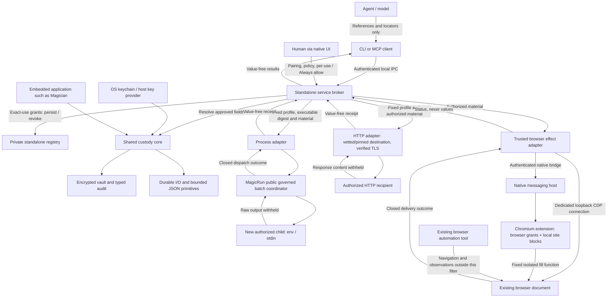
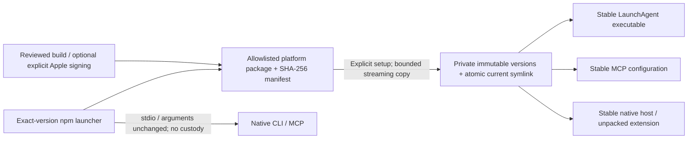
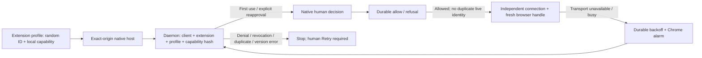

# MagicVault architecture

Architecture version: `0.8.2`

Previous immutable baseline tag: `architecture/v0.3.0`. The current reviewed
source/document baseline is [architecture-baseline.json](architecture-baseline.json).
Updating this document does not create a Git tag or announce a package release.

This is the technical baseline for standalone browser, process and HTTP delivery and
its shared libraries. The version labels the architecture, not a production
certification or a registry publication. [Capabilities](../README.md#what-works-today)
and [security](../SECURITY.md) define the product's supported boundary.

## Components and trust boundaries

The client, broker, custody library and delivery adapter are different authority
boundaries. CLI/MCP requests contain references, not credential values. Trusted
core/effect/native code necessarily handles plaintext. The destination website
receives it; separate browser tools and unrestricted same-user software are not
isolated by this integration. New processes and HTTP services receive plaintext
inside their authorized boundary too. Neither CDP nor the extension is a generic
proxy. Process/HTTP adapters withhold all recipient output instead of attempting
generic substring redaction; coarse outcomes and timing remain observable.

Async browser, process/HTTP and metadata jobs own the single human-operation slot
through consent, recipient/native cleanup and durable completion audit. The final
serialized completion closure also owns that slot: it drops it before releasing
the state lock that publishes the terminal receipt. Returning a receipt must not
depend on the async worker being rescheduled to finish releasing admission.
Persistence errors still fault custody and publish uncertainty; freeing the slot
does not authorize another effect on a faulted instance.
Shutdown first cancels work and obtains admission, then closes/waits for the
tracked background jobs and their destructors. This drains async broker/instance
lock ownership after terminal publication; slot availability alone is not proof
that an immediate restart can acquire the old instance lock.

| Component | Version | Ownership |
| --- | --- | --- |
| `magicvault`, `magicvault-mcp` | `0.8.2` | Human administration, reference-only clients and optional discovery narrowing; CLI builds daemon/native host |
| `magicvault-service` | `0.8.2` | Native consent/grants and cancellation, bounded discovery, one store writer and private application-bundle installer |
| `magicvault-protocol` | `0.6.0` | Discovery query/filter types; authentication, policy, consent, profiles, jobs and bounded IPC |
| `magicvault-effect` | `0.6.0` | Filtered adapter method/native command; CDP/native fills, HTTP and MagicRun integration |
| Chromium extension | `0.6.1` | Permission-aware exact discovery narrowing, site grants/blocks and document-targeted fill; no navigation or submission API |
| MagicRun `tool-runtime-core` | `0.1.73`, existing public Git dependency | Governed process preparation, digest-bound dispatch, cancellation, output bounds and owned-child cleanup; runtime source unchanged |
| `magicvault-core` | `0.1.3` | Encryption, credential references, existing policies, scoped stores and typed audit |
| `magicvault-primitives` | `0.1.1` | Durable filesystem and stack-safe JSON utilities |

The local agent wire is version **4**; matching standalone clients/daemon are required. The profile-authenticated native
handshake is version **2**; bridge framing and host configuration remain version **1**.
Filtered discovery adds a closed `filtered_targets` bridge command; use matching
updated components. Old workers refuse it; no broader-query or delivery fallback.
Wire versions and crate versions are distinct. See the [protocol](protocol.md)
for framing, message types and bounds, and [versioning](versioning.md) for upgrades.

## Distribution and stable application lifecycle

Distribution does not move credential custody into JavaScript. npm has no lifecycle
hooks, runtime downloads, daemon initialization or native enrollment. The launcher
checks the selected platform/version and binary hash before an argv-preserving,
shell-free spawn; stdout belongs exclusively to the native protocol.

`~/.magicvault-app` is separate from `~/.magicvault`, with a root-bound ownership
marker and installer lock. Fixed-path, bounded, no-follow reads stream into private
version directories; a durable bundle marker follows all file/directory syncs.
Activation atomically publishes only a relative `current` symlink after complete
reverification. Existing versions and ambiguous staging artifacts are retained.
Same-user unrestricted software and a compromised publisher remain outside this
isolation boundary; integrity manifests do not replace publisher authentication.

Native setup explicitly initializes/starts/pairs with existing human consent.
Upgrade/uninstall require exact managed service ownership and wait for the custody
writer lease after unloading, before activation or recoverable app retirement.
Stable paths outlive npm/npx caches; clients obtain fresh handles after upgrades.
Normal setup additionally registers the bundled extension's exact public identity;
install-only does not. The native installer serializes updates with a private
root lock and repairs only exact managed definitions, refusing foreign/modified
files or a different root/client/executable. Config is published last, so an
interrupted identity migration may deny connections but cannot broaden access.
Upgrade preserves explicitly selected custom IDs; setup selects the bundled ID.
Normal setup and `doctor` project an advisory extension-readiness snapshot from
bounded private native-definition reads and the existing caller-scoped
`ListBrowsers` RPC (two-second probe deadline). Registration verification checks
exact manifests/wrapper, executable safety and local pairing structure without
repairing files; it is not browser-extension installation detection or publisher
verification. Only a live extension connection confirms presence. No connection
leaves installation unconfirmed; CDP connections never count. Diagnostics neither
scan browser profiles nor grant authority, and do not gate other delivery surfaces.
Uninstall preserves the vault/keychain/pairings. No new agent tool or agent wire
change is introduced; the native handshake requires a coordinated upgrade. Core, primitives, MagicRun and Magician need no source or data
migration. [Installation/recovery](distribution.md) covers partial-state behavior.

The architecture gate includes npm launchers, package assembly/qualification,
signing script and both qualification/distribution workflows as executable trust inputs. Release
credentials/publication remain separate authorized operator actions; the checked-in
workflow produces explicitly unsigned local-tarball candidates only.
Qualification can run 1–20 independent installed-client trials, failing on the
first error, plus explicit bounded load/capacity/shutdown probes. These use only
synthetic custody in test executables, not a production bypass or daemon flag.
The process adapter's serial and async-with-child-churn stress tests capture closed terminal classes and
known-error booleans only under `cfg(test)`; neither that observer nor arbitrary
recipient diagnostics is compiled into the shipped client or service.
The exact CLI-to-broker integration fixture can separately enable
`magicvault_test_diagnostics`, a custom debug-only compiler cfg, not a Cargo
feature or runtime option. It registers at most 16 operation-specific captures;
only closed terminal/dispatch/error categories and known-error booleans survive.
No raw stream, exit code, path or credential is retained by the observer. Dropping
a capture removes its registry entry. Normal builds omit this module and its
hooks; the standard release profile explicitly rejects the cfg. The package
qualifier isolates diagnostic build outputs from packaging and proves that
rejection before running the installed-client trials. Installed clients remain
the unchanged package bytes; only their synthetic broker/test driver is observed.
These observations classify a failure, not its root cause or retry safety.
Browser qualification requires explicit `--app-parent`; its Make target selects
an internal temporary application separately from external build/package artifacts.
The external-host path can block in macOS loader/access-policy work before the
synthetic provider starts. An opt-in test-only sampler checks the fixture PID's
image before retaining a bounded private stack capture; it never reads protocol
frames or changes OS permissions. These are diagnostic/qualification seams, not
production behavior or a fix for unexplained process uncertainty.
CPU/RSS counters cover the in-process test
broker and driver, not an installed-daemon or whole-browser-tree benchmark.

## Browser-profile connection lifecycle

Only the trusted worker stores the random 256-bit reconnect capability, alongside
site settings, pause state and retry deadline; it never syncs or returns the
capability through options/agent messages. The daemon persists up to 128 hash-bound
profile decisions scoped to client/extension/profile, including a refusal before
first consent. Reconnects reuse approval without taking the human-prompt gate.
Client revocation removes grants; browser disconnect revokes just its native
profile. Local Pause does not erase an existing approval. Duplicate/copied profile
identities never evict a live connection. Nonblocking socket EOF detection reaps
quiet dead hosts and cancels old pending effects without consuming replies. A
dedicated cloned socket descriptor keeps health probes off the effect mutex, so
concurrent status polling cannot make delivery spuriously busy. Disconnect shuts
down both descriptors' shared socket, rather than retaining a silent open peer.

Chrome alarms implement 30–300-second exponential backoff plus up to five seconds
of jitter for transport/busy failures, not exact-time scheduling. Worker startup
restores lost alarms and respects the persisted deadline/pause. Terminal errors
require explicit Retry; every effect remains one-use, never replayed by reconnect.
Native framing validates closed greetings and commands; v1 handshake downgrade is
refused. Browser permissions, per-credential rules and per-use or remembered consent remain separate checks.
The fixed public unpacked identity is not a signing key or a Store listing.

## One fill, end to end

Extension discovery queries Chrome's granted URL patterns and excludes discarded
tabs without waking them. Missing URLs, unsupported schemes and blocked sites
are omitted before the 128-candidate frame-inspection budget. Permissions are
cached only within one discovery revision; document/frame origins are checked
again after tab enumeration. Any observed site-policy or permission change
invalidates the response. At most 128 frames per candidate are inspected and
128 targets returned; candidate/response overflow fails with `capacity`, not a
silently truncated result. Optional exact top-origin/tab filters are validated
by the broker and applied before inspection; the native bridge also validates
returned targets against them. Chrome URL match patterns ignore ports, so exact
origin comparison occurs before candidate admission and again on actual frames.
Fill authorization and permission checks are uncached and unchanged. No broad
`tabs` permission is added. Filtered native discovery uses its own closed command.

CDP applies the same optional narrowing to supported page targets before its
128-tab inspection budget, then rechecks discovered document metadata. A local
candidate/total-target overflow at a completed protocol boundary returns
`capacity` while preserving the connection for a narrower discovery. Timeout,
malformed reply and frame/transport failures still invalidate the connection;
this exception never retries an effect or preserves uncertain delivery state.

Extension access is separate from credential authorization. Chrome grants remain
optional: a human chooses all HTTPS once or selected hosts; local HTTP is always
separate. Existing grants are retained on upgrade. Resetting to selected sites
clears HTTPS grants, not local HTTP or blocks. A bounded, versioned site blocklist
in trusted-context-only `chrome.storage.local` stores no material and does not sync.
Only the exact extension setup page can ask the worker to mutate it; one writer
prevents lost updates between setup tabs. Storage failures/corruption fail closed.
Discovery reads policy once per enumeration; document-bound fills re-read policy
after asynchronous document checks and recheck Chrome permissions before dispatch.
Policy-write and permission-change revisions invalidate in-flight preflight;
changes after dispatch cannot recall an effect. Blocks cover exact scheme/host
across ports, apply to top and selected frames, and are not Chrome permission
revocation or protection from compromised extension code. No crate or wire change
is needed; the fixed fill function and Magician's shared custody remain unchanged.
The setup page reads its persistent access indicator directly from Chrome,
independently of worker/blocklist availability. Permission events and page return
refresh it without polling or caching a user click as authority; stale reads are
discarded and permission-read failures show an unverified state.

Browser document IDs are opaque browser-owned strings, not daemon UUID handles.
The extension accepts observed 32-hex Chrome tokens and the retained hyphenated
format, preserves their exact bytes/case, and checks both top and selected
documents before dispatch. `scripting.executeScript` receives the exact
`documentIds`, never a frame-only fallback. Supporting Chrome's actual token
format does not weaken origin, document-lifecycle, permission or consent checks.
The [real transport qualification](qualification/results-native-transport-2026-09-07.md)
uses test-only disposable user-data roots, native manifests and synthetic consent;
none of those helpers or test configuration overrides enter production binaries.

1. A human pairs a client and enrolls values through native hidden inputs. Listing
   metadata does not grant delivery. The human separately authorizes selected
   fields and exact origins for that client.
2. CDP registration or an approved extension connection creates a caller-owned
   browser handle. Discovery binds short-lived targets to the tab/frame, actual
   document and top/selected origins; another tool's snapshot IDs are not handles.
3. `secure_fill` admits a closed reference-only request, spends its target handle
   and operation ID, and requests consent or captures an existing exact-use grant.
4. Immediately before delivery, the service rechecks authority, cancellation,
   expiry and target binding, then resolves material through the custody core.
   Browser I/O and human waits do not hold the custody lock.
5. The adapter executes a fixed isolated fill function. Strict input preflight
   precedes the first write, and later controls are revalidated before each write.
   The original automation tool retains browser ownership and form submission.
6. The service persists a typed completion receipt and returns only status.
   Partial writes, lost replies and audit uncertainty are not successful rollback
   and never cause automatic retries. Faulted custody permits status reconciliation
   while refusing new effects.

Detailed results expire; spent IDs remain refused for the daemon epoch. Restart
invalidates connections/handles/jobs. Missing status is not proof that a fill
did not happen. [Lifecycle and recovery](browser-usage.md#request-a-fill-and-inspect-its-outcome).

## One new process or HTTP request

### Exact-use consent state

The default is a fresh native use decision. Only `HumanInteraction::confirm_use`
can return Always allow; its default implementation delegates to the old boolean
confirmation as Allow once, preserving trusted embedders' behavior. Administrative
confirmation and hidden enrollment are unchanged. No protocol/MCP call accepts an
allow choice or a caller-defined grant scope.

`broker/consent.rs` derives exact scopes from registered destinations or captured
browser targets. A final transaction revalidates grants before custody resolution;
new grants are durably saved/audited. Reset/revocation invalidates pending decisions
and cancels affected jobs. The human/effect permit still covers effect completion
and shutdown draining, including remembered uses; grants do not introduce a new
concurrent execution path.

Process/HTTP grants bind immutable profile IDs and survive restart. Native-browser
grants bind paired client, extension/profile identity, exact top/frame origins,
frame kind and ordered field/CSS mapping; live CDP/custom-adapter grants instead
bind one connection and are discarded on disconnect/restart. Browser scopes are
not restricted to one tab or path. Permission checks, current documents, digest
validation and single-use operation IDs remain independent requirements.

The standalone registry adds optional grant records (empty by default), capped at
16 records of 12 KiB each within a 1.25 MiB file limit. List replies fit the existing
256 KiB bound. CLI exposes list/revoke/clear only; MCP keeps its existing closed
catalog. Agent wire is now `4`, native handshake `2` and effect framing `1` are
unchanged. Shared custody/key identity and MagicRun's runtime do not change.
See [consent semantics and recovery](consent.md).

### Delivery sequence

1. A human registers a caller-owned, immutable profile containing reference-only
   credential placements and an exact executable/argv/cwd or URL/method. Process
   registration captures an executable content digest; no effect runs here.
2. The agent selects that profile and an operation UUID. Admission reserves the
   one-use identity and shared human/effect permit before prompting or reusing an
   exact-use grant. Registration is not use consent, and metadata access is not
   effect authority.
3. After consent, the broker rechecks caller/profile/field authority, cancellation
   and deadline under its writer, appends durable authorization, and resolves the
   selected material once. The `running` transition is the dispatch-authority
   boundary; revocation afterward requests cancellation, not retroactive rollback.
4. No child/network I/O holds the writer. Process work goes through MagicRun's
   existing public coordinator with a clean environment, exact arguments and the
   registered executable digest. HTTP uses vetted/pinned public destinations,
   verified TLS, no redirects/ambient proxy/retries, and bounded response discard.
   Explicit loopback IP HTTP is allowed for trusted local recipients only.
5. Child stdout/stderr/exit codes and HTTP bodies/headers/raw status codes never
   become agent output or audit data. The broker durably settles only typed IDs,
   kind, coarse state, `may_have_run` and a closed error. Audit failure faults
   custody and preserves authenticated status reconciliation.
6. The workflow keeps the shared permit through owned-child cleanup and final
   audit. Profiles persist; jobs expire, with epoch-local spent-ID tombstones.
   Missing results and new epochs never authorize automatic replay.

Pending native prompt teardown can return a denial-shaped provider error. As
with browser fills, the delivery broker preserves an explicit expiry and otherwise
reports its cancelled token as `cancelled`, not a human `denied` decision. This
normalization happens before custody resolution; it cannot turn a refusal into
dispatch or mask a later durable-write/recipient failure.

Profiles are capped at 16 × 12 KiB to fit the bounded 1.25 MiB registry alongside
maximum ACL/browser state. There are 32 retained delivery jobs, 4096 spent IDs,
1–120 second effect deadlines, 64 KiB per child output stream and 1 MiB discarded
HTTP body. System DNS waits are bounded; up to two credential-free OS resolver
threads retain their permits even if a caller times out. They cannot accumulate
or hold Tokio shutdown open. [Exact formats and limits](delivery-usage.md).

The process adapter is not a sandbox, whole-program attestation or arbitrary
running-process injector. Script inputs, libraries and recipient-selected
network activity remain trusted. New HTTP does not update a stateful client or
existing connection pool. The shared core, primitives, MagicRun runtime and
Magician need no API, source or storage migration for these standalone additions.

## Integration invariants

- **Core isolation:** shared core/primitives do not acquire the standalone
  daemon, browser adapter, MCP or extension as dependencies. Embedded consumers
  keep their own roots, key identities, policy and execution ownership.
- **Authorization before material:** client/field/origin/document policy and
  native per-use or human-created exact-use consent precede custody resolution and delivery. No raw-value
  model tool or production auto-approval switch is part of the contract.
- **Transport separation:** agent IPC is reference-only; trusted native/CDP
  transport can carry values. Shipped executables compile dependency payload
  logging out; Rust embedders must enforce their own logging boundary.
- **Browser identity:** direct CDP requires a supported loopback browser websocket
  and a system-unique execution context. The extension needs exact native-host
  identity, site permission and explicit document targeting. Opaque or unsupported
  frames/controls fail closed.
- **Bounded, non-replaying work:** admission, messages, contexts, jobs, deadlines
  and audit output are bounded. Disconnecting this integration never closes the
  user's browser. Cancellation cannot recall delivered material.
- **Honest scope:** new HTTP/process profiles are standalone surfaces, not a
  general-purpose programmable secret client. Existing-service refresh, PTY/PID
  injection and other tools' observation filtering are not exposed. Recipients
  can copy credentials. MagicRun is a dependency of the effect crate, never of
  shared custody, and is invoked only for new-process delivery.

## Source map

| Responsibility | Source |
| --- | --- |
| Closed browser contract | `magicvault-protocol/src/browser.rs` |
| Authority, consent and operation state | `magicvault-service/src/broker/browser.rs` |
| Closed process/HTTP profiles and receipts | `magicvault-protocol/src/delivery.rs` |
| Profile authority and delivery lifecycle | `magicvault-service/src/broker/delivery.rs` |
| Trusted material, HTTP and MagicRun process adapters | `magicvault-effect/src/delivery.rs`, `http.rs`, `process.rs` |
| Store ownership and authenticated transport | `magicvault-service/src/storage.rs`, `ipc.rs`, `client.rs` |
| CDP and native adapter | `magicvault-effect/src/cdp.rs`, `bridge.rs`, `fill.js` |
| Native installation and executable | `magicvault-service/src/native.rs`, `magicvault/src/bin/magicvault-native-host.rs` |
| Browser extension | `extension/worker.js`, `options.js`, `manifest.json` |
| Shared custody and utilities | `magicvault-core/src`, `magicvault-primitives/src` |

## Detecting architectural drift

[architecture-baseline.json](architecture-baseline.json) binds this document to
the current package versions and SHA-256 fingerprints of workspace/package
manifests, production `src/` files, the root lockfile and extension assets.
New/removed inputs, dependency changes, source edits or a version/document mismatch
make `make check-architecture` fail. `make check` and manual qualification CI
include that gate. No Git hook, push or publication is implied.

The fingerprint is deliberately coarse: it flags possible drift, including
non-architectural source edits, but cannot prove semantic correctness or prevent
an operator from approving a bad baseline. It is not a security attestation or a
replacement for [conformance tests and native acceptance](testing.md).

When it fails, review the changed boundaries and update this document's diagram,
invariants and version when needed. Then inspect the candidate from
`make -s architecture-snapshot`, replace the baseline **only after that review**,
run `make check-architecture test-architecture`, and commit code, document and
baseline together. Never refresh the fingerprints simply to silence the gate.
The guard's member-discovery rules must also be reviewed if the workspace layout
changes. Documentation-only changes outside this architecture file do not
invalidate production fingerprints.
