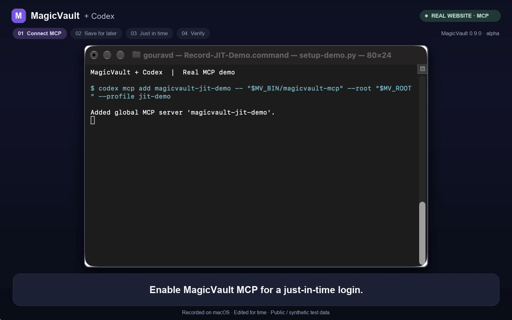

# Just-in-time MCP demo



[Watch with narration](assets/magicvault-mcp-jit-demo-narrated.mp4) ·
[Silent MP4](assets/magicvault-mcp-jit-demo.mp4) ·
[Static poster](assets/magicvault-mcp-jit-demo-poster.png) ·
[Actual MCP transcript audit](assets/magicvault-mcp-jit-demo-audit.json) ·
[Build, edit and positive-control evidence](assets/magicvault-mcp-jit-demo-evidence.json)

This **1-minute 33-second** recording shows a real Codex CLI session using
MagicVault MCP to log in to
[Practice Test Automation](https://practicetestautomation.com/practice-test-login/)
in Chrome. It briefly shows how to store a login and synthetic card fields, then
uses **just-in-time input for the actual login**. The human enters the website
credentials in MagicVault's masked desktop windows and approves **Use once**.
No saved credential is used for that login, and no record is added.

The dark frame, chapter labels and bottom-centred captions surround actual
application captures. Captions occupy a separate panel below the windows.
The narrated MP4 adds a synthetic English voice generated with MiniMax CLI,
timed to the same scenes. The GIF remains silent.

| Time | Recorded step |
| --- | --- |
| 0:00 | Enable the MCP server in Codex and check its configuration. |
| 0:07 | Approve local client pairing in MagicVault's desktop window. |
| 0:11 | Glimpse optional enrollment: a saved login and synthetic card fields, entered privately. |
| 0:25 | List saved references and field names; approve the dedicated browser connection. |
| 0:32 | Introduce the one-time flow and ask a fresh Codex session to log in. |
| 0:41 | Codex calls `secure_prompt_fill` using destination metadata. |
| 0:46 | Enter the username and password in masked native windows. |
| 0:56 | Review the destination and approve **Use once**. |
| 1:03 | MagicVault fills the fields; Codex submits the form and verifies the successful login. |
| 1:12 | Inspect Codex's receipt and unchanged saved-record list. |
| 1:19 | Audit the actual MCP calls, replies and login-agent transcript. |

## What the recording verifies

The final segment runs `scripts/audit-mcp-demo.py` against the actual login
agent's Codex rollout. The shared report includes all **six MagicVault MCP call
expressions and six replies**, their timestamps and the rollout's SHA-256 hash.
The sequence is `list_browsers`, `list_credentials`, `browser_targets`,
`secure_prompt_fill`, `fill_status`, then `list_credentials` again. There is
exactly **one JIT fill and zero saved-credential fills**.

The final receipt is `filled`, with both fields filled and no reported error.
Codex separately verified the real website's **Logged In Successfully** heading.
The saved metadata before and after is identical: **two example records → two
example records**, including the same references, labels and field names.

Both public practice-account values had **zero literal matches** in the MCP
call source, MCP replies and complete recorded login-agent rollout. A positive
control inserted the public password into a copied MCP reply; the audit detected
it in both that reply and the copied rollout. The original recording was
unchanged. Two automated audit tests cover positive detection, namespace
mismatch, incomplete fill and changed saved metadata.

This is evidence for the recorded session, not a general security proof. The
login agent did not load browser screenshots or credential values into its
context. The demo editor separately inspected captures and knows the public
practice account. The website publishes those values on its login page and
receives them when filled; other browser tools can observe them. MagicVault's
own replies contain metadata and status, not credential values. The literal
audit does not check every possible encoding or observation channel.

## What was running

- MagicVault **0.9.0**, source commit `d00398cf6de8166550790b6de337b5d771772eaf`,
  built locally in the debug profile on macOS arm64 with the desktop prompt
  feature. Binary hashes are in the linked evidence file.
- A fresh, isolated vault with macOS Keychain custody and a running daemon;
  the `jit-demo` client profile was paired by the human.
- Codex CLI **0.154.0**, connected to the real stdio `magicvault-jit-demo` MCP
  server. The older demo server was disabled in this login session.
- A dedicated Chrome profile registered through MagicVault's CDP route.
- Human credential entry, native approvals and Codex tool approvals.
  `cua-driver` handled ordinary browser submission/verification and separate
  window capture. The login agent used the verified form selectors, without
  reading the website's public credential hints.

The two saved records are unrelated storage examples. The login uses values
entered during the task. This take demonstrates that an existing saved record
is unnecessary for JIT use; empty-vault behavior also has automated coverage in
[the one-time flow documentation](jit-credentials.md).

This is one successful native macOS flow, not complete desktop qualification
or an npm/signed-package acceptance run. Linux and Windows retain their
[separate validation status](platforms.md#verification). Installation and daemon
startup occur before the video. Saved-credential delivery, HTTP/process delivery
and the separate Magician agent integration are outside this recording.

## Source and editing

Every application window, prompt and tool result comes from this live take.
Waiting time is cut; selected intervals are sped up or slowed down. Native
windows are cropped to remove unused space while retaining the request and
controls. The success page, final Codex response and audit screens are real
still captures held for readability. The clean success shot follows dismissal
of Chrome's save-password offer by the editor.

An initial card-enrollment command was rejected before showing a dialog because
its label contained an unsupported character. The label was corrected to ASCII
and card enrollment continued; that rejected setup attempt is omitted from the
edit. The saved login was not enrolled twice, and the JIT fill was not retried.

Local raw captures, setup helpers and the timestamped edit manifest are in
`output/jit-mcp-demo/`, excluded from Git. The published evidence contains build
hashes, selected capture times, captions and positive-control results, with no
credential values. Older recordings remain in Git history; the current checkout
contains only the JIT demo assets.

With the local captures present, Python 3, Pillow, FFmpeg and Arial or DejaVu
Sans reproduce the edit:

```bash
python3 scripts/render-jit-mcp-demo.py --capture-root output/jit-mcp-demo --preview
python3 scripts/render-jit-mcp-demo.py --capture-root output/jit-mcp-demo
```

The MP4 is 1600 × 1000 at 12 fps; the looping GIF is 1280 × 800 at 8 fps.
Source window screenshots were sampled at approximately 2 fps. These exports
are an edited screen demonstration, not an uninterrupted desktop video.

### Narration

The [narration script and timing report](assets/magicvault-mcp-jit-demo-narrated.json)
records 17 segments generated with MiniMax CLI 1.0.18, `speech-2.8-hd` and the
`English_expressive_narrator` system voice. Only the written narration is sent
for synthesis. The source screen recording and vault contents are not uploaded.

Each clip starts within its matching scene. The mixer trims silence at the
outside edges, preserves pauses within sentences and applies a small speed
adjustment only where needed. It refuses an adjustment above 1.18× or a changed
source video. The full track is normalized toward −16 LUFS with a −1.5 dBTP peak
limit, then encoded as 48 kHz AAC. The original video stream is copied intact.
This is an added voice-over; it is not audio captured during the login.

To reproduce using an authenticated [MiniMax CLI](https://github.com/MiniMax-AI/cli),
place the shared narration JSON at `output/jit-mcp-demo/narration/plan.json`.
The existing silent MP4 must match its source hash. Then run:

```bash
python3 -B scripts/narrate-jit-mcp-demo.py generate --mmx /path/to/mmx
python3 -B scripts/narrate-jit-mcp-demo.py mix
```

Generation uses the CLI's login, caches matching completed requests and stops
on an error. Mixing uses local clips only. Raw speech files and provider replies
stay in ignored `output/`; the shared report contains text, timings and hashes.

### Transcript audit

Re-run the audit against the local login-agent recording:

```bash
python3 scripts/audit-mcp-demo.py \
  --rollout /path/to/recorded-codex-rollout.jsonl \
  --server magicvault_jit_demo --require-jit \
  --output output/jit-mcp-demo/transcript-audit.json
python3 -B -m unittest discover -s scripts/tests -p 'test_demo_audit.py'
```

The parser is specific to the public practice-account demo and the supplied
MCP namespace. Do not supply private secrets as canaries. `--display` shows
the computed audit in a terminal; `--screen 3` selects the credential-value
counts and `--screen 4` selects the JIT/before-after metadata check.

## Recording another take

Use an isolated vault/client profile, a trusted public test account and a
dedicated browser profile. Start the local service, then record MCP activation,
pairing and browser registration. The [setup guide](setup.md) covers installation.
For a default installed bundle:

```bash
codex mcp add magicvault -- "$HOME/.magicvault-app/current/bin/magicvault-mcp" --profile agent
codex mcp get magicvault
```

This follows the [official Codex MCP documentation](https://learn.chatgpt.com/docs/extend/mcp?surface=cli).
Keep ordinary browser automation available for navigation and submission.
Leave security approval and credential entry to the human. Optional saved
examples must remain separate from the JIT login; cards use synthetic data.

Record the actual call, masked inputs, **Use once**, browser fill, receipt,
submission and website result. Compare saved metadata before and after. Run the
transcript audit and its positive control outside the login agent's session.
Update the edit's source times for each recording and inspect the encoded output.
Keep a future Magician/agent demo in its own file.

## Earlier recordings

The older saved-credential demos and illustrated overview are retained in
[the previous source revision](https://github.com/MagicBeansAI/MagicVault/tree/7fd0731/docs/assets).
They use the previous renderer and are not evidence for this JIT flow.
